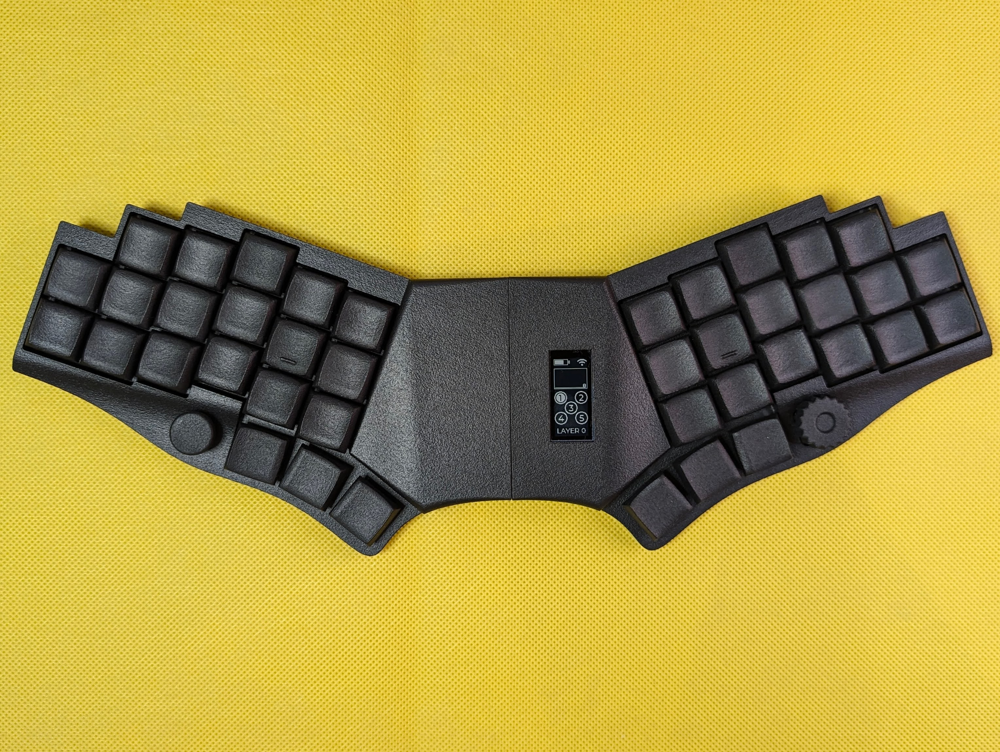
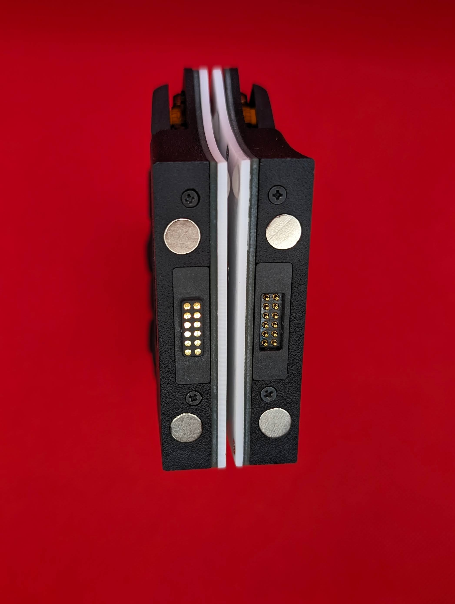
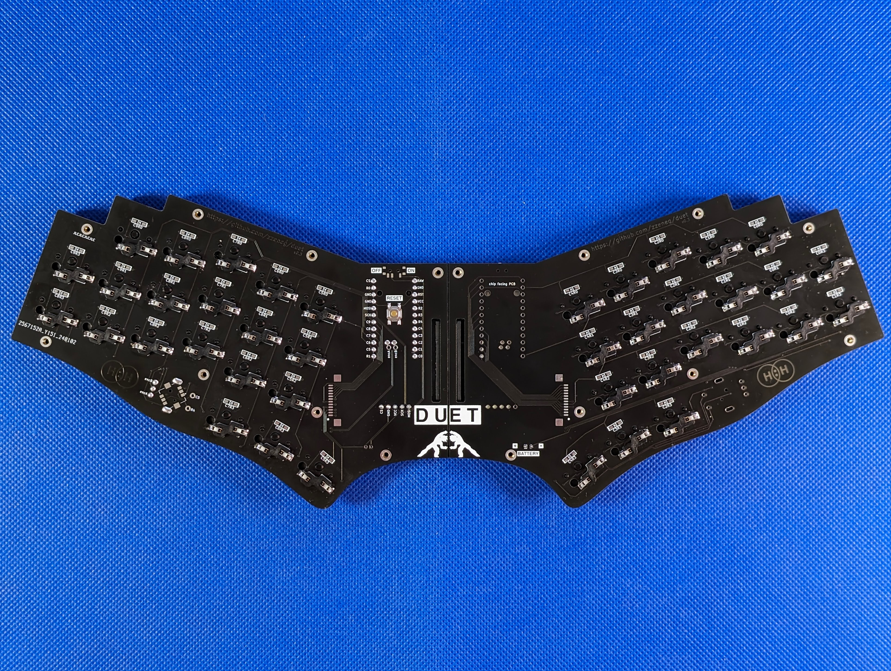
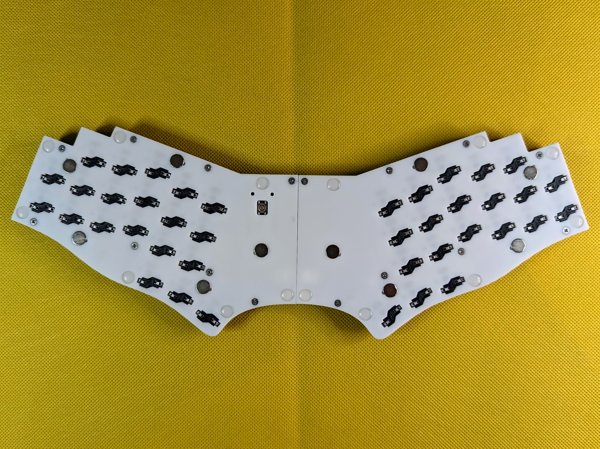

# duet

## CAUTION

This is based on the work of zzeneg. The intent of this fork is to convert the duet into a standard x / min y spacing verison, to be used with [CMY keycaps](https://github.com/sadekbaroudi/fingerpunch/tree/master/keycaps/CMY)  

In addition to this, I have added strong pinky stagger.  

Please reach out in the [fingerpunch discord server](https://fingerpunch.xyz/discord) if you are interested in building this.  

Everything below is the original readme, and has not been updated to reflect the changes in this repository.

--------------------------------------------------------------------------------------------

Wireless unibody/unsplit portable keyboard.

## Features

- wireless (nice!nano MCU)
- unibody that can be disassembled into two parts for traveling
- 40 Choc V1 switches
- 1 rotary encoder and 1 five-way switch
- reversible PCB
- 3D printed case
- nice!view support

## Photos

https://github.com/zzeneg/duet/assets/910255/740595a8-76a9-42da-903d-3cff3896a925

[...more](./images)

## Firmware

[zmk-config](https://github.com/zzeneg/zmk-config/tree/duet) - my custom keymap, use it for testing only. Fork and create your own keymap instead.

## Instructions

[Build guide](./guide/readme.md)

All files are available in repo or [GitHub release](https://github.com/zzeneg/duet/releases/latest).

## Support

If you like my work and want to support my future designs, please consider [sponsorship](https://github.com/sponsors/zzeneg).

#### Sponsors

